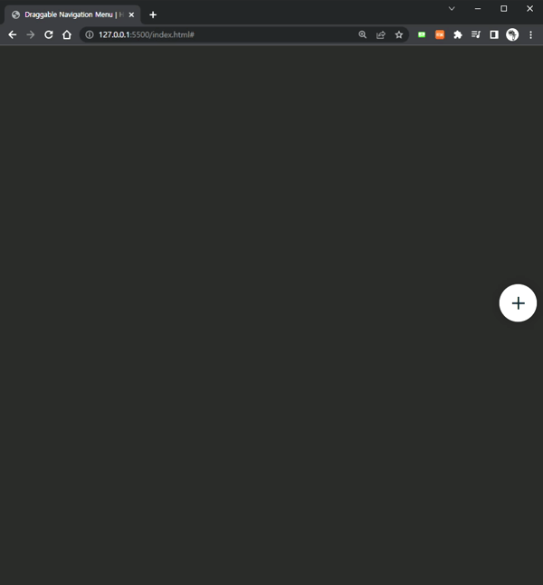

# 

## Draggable - Circular - Navigaion -  Menu

JS 공부중에 재밌는 걸 구현할게 뭐가 있을까 생각하다가 세로로 드래그하면서 쓸 수 있는 navigion을 구현할 수 있을까 해서 구현해보았습니다.  

구현하면서 window에서 Height값을 구해서 상하 최대 범위를 설정해주고 넘어가지 않도록 세팅하는 것이 구현하는 데 중요하다고 생각합니다.